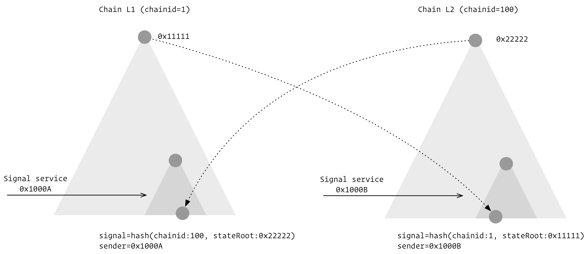
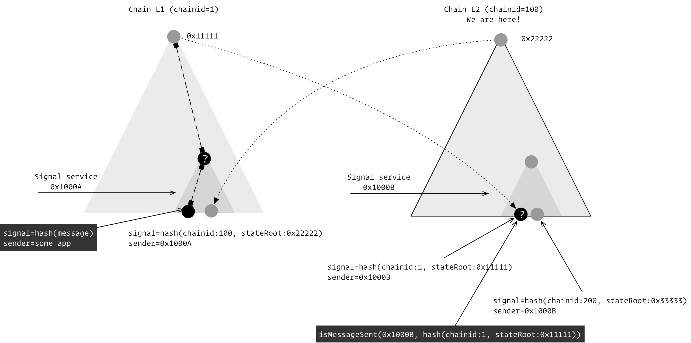
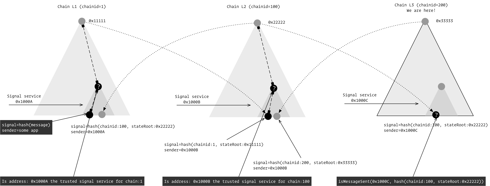
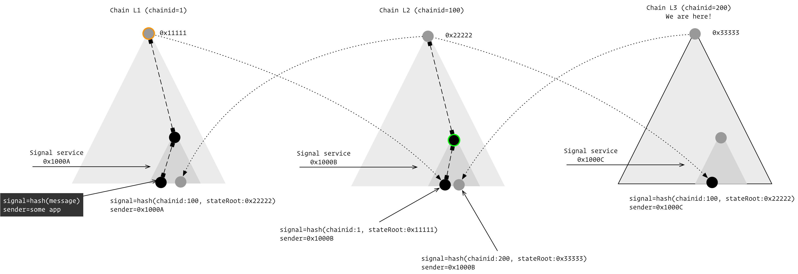
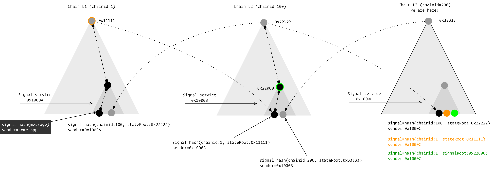

# Multi-hop cross-chain bridging

This document explains how multi-hop cross-chain bridging works in Taiko.

## L1<->L2 data synchronization
We'll use this diagram to illustrate a blockchain's state. The large triangle represents the world state, while the smaller triangle represents the storage tree of a special contract named the "Signal Service," deployed on both L1 and L2.


When a signal is sent by the Signal Service, a unique slot in its storage is updated with a value of `1`, as shown in the Solidity code below:

```solidity
function _sendSignal(address sender, bytes32 signal) internal returns (bytes32 slot) {
    if (signal == 0) revert SS_INVALID_VALUE();
    slot = getSignalSlot(uint64(block.chainid), sender, signal);
    assembly {
        sstore(slot, 1)
    }
}

function getSignalSlot(uint64 chainId, address app, bytes32 signal) public pure returns (bytes32) {
    return keccak256(abi.encodePacked("SIGNAL", chainId, app, signal));
}
```

Merkle proofs can verify signals sent by specific senders when the signal service's state root is known on another chain. A full merkle proof comprises an *account proof* and a *storage proof*. However, if the signal service's storage root (or the *signal root*) is known on another chain, only a storage proof is necessary to verify the signal's source.


Taiko's core protocol code (TaikoL1.sol and TaikoL2.sol) automatically synchronizes or relays the state roots between L1 and L2.

When chainA's state root is relayed to chainB, a special signal is sent in chainB's signal service. This signal is calculated incorporating chainA's block ID. These special signals are always sent by the target chain's signal service.



If you deploy more chains using Taiko protocol, you can create a chain of relayed state roots between them.


## Verifying bridged messages

### One-hop bridging
Consider the 1-hop example below.

To verify that "some app" has sent a custom message, we verify if the corresponding signal (associated with the message sender, "some app") has been set by the signal service (0x1000A) on L1. After L1's state root is relayed to L2, we need the following info on L2 to verify the message on L1:

1. Message's signal and its sender, to compute the storage slot now supposed to be 1.
2. A full merkle proof generated by an L1 node for the above slot.
3. L1 signal service's address associated with the merkle proof.
4. L2 signal service's address to verify that L1's state root has been relayed to L2 already.



### Multi-hop bridging
In the 2-hop example below, two merkle proofs are needed, and the signal service addresses for L1 and L2 need verification. L3's signal service address does not need verification as the bridging verification occurs in L3's signal service contract, with L3's signal service address being `address(this)`.



## Caching

Caching is optional and is activated per hop when the transaction intends to reuse some state root or signal root for future bridging verification.


In the diagram below with 2 hops, L1's state root and L2's signal root can be cached to L3 if specified.



If both are cached, two more signals will be sent in L3's signal service.



Depending on the type of data (state root or signal root), the signal is generated differently.

```solidity
function signalForChainData(uint64 chainId, bytes32 kind, bytes32 data) public pure returns (bytes32) {
    return keccak256(abi.encode(chainId, kind, data));
}
```

Once cached on L3, one full merkle proof is sufficient to verify everything that happened on L1 before or when L1's state root becomes 0x1111. This allows skipping the middle-hop.


If L1's state root is not cached on L3 but only L2's signal root is, then one full merkle proof for L1 and a storage proof for L2 are used to verify a bridged message.


Note that the last hop (L2)'s state root has already been auto-relayed to L3, so it cannot be recached. Therefore, only the last hop's signal root can be cached.

For all other non-last hops, if a full proof is used, the state root can be cached; if a storage proof is used, the signal root can be cached. But by default, caching is all disabled.